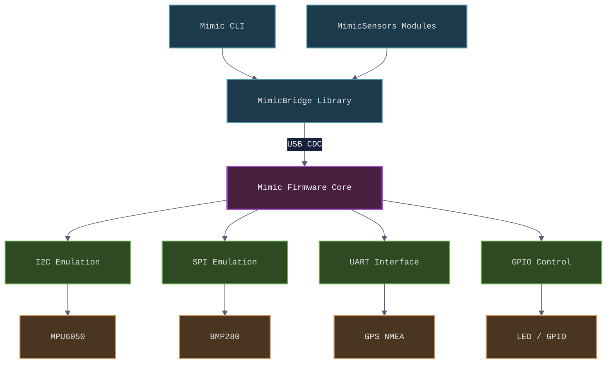
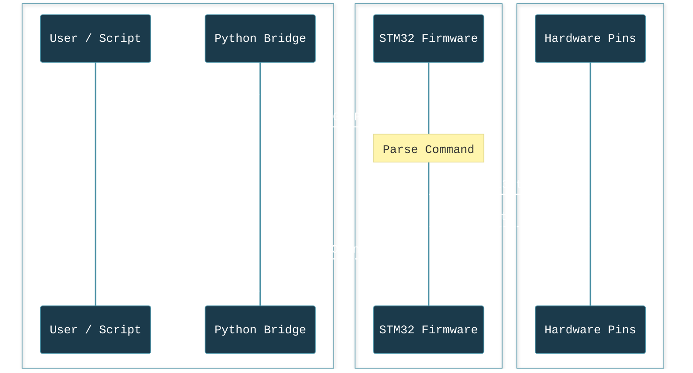

# System Architecture

The Mimic framework bridges a host computer to physical hardware peripherals. The core architecture relies on an STM32-based hardware component running the Mimic Firmware, connected to a Python-based host bridge over a serial protocol.

## High-Level Architecture

The following block diagram illustrates the flow of data from the host machine to the hardware peripherals:

## How It Works

1. **Python Bridge:** The user sends a command (e.g., `PIN_HIGH PC13` or `simulate mpu6050`) using the Python library (`mimic-fw`).
2. **Serial Transmission:** The `MimicBridge` translates this into a compact string protocol and transmits it over USB.
3. **Firmware Execution:** The STM32F411 micro-controller interprets the packet. It bypasses heavy abstractions (like standard HALs where necessary) to maintain high-precision, low-latency emulation logic.
4. **Peripheral Activity:** Signal levels are changed on GPIOs, or dummy register shadows are updated to fool the Master device into thinking a real MPU6050 or BMP280 is connected.

## Command Execution Flow

---
*© [Aegion Dynamic](https://aegiondynamic.com)*
