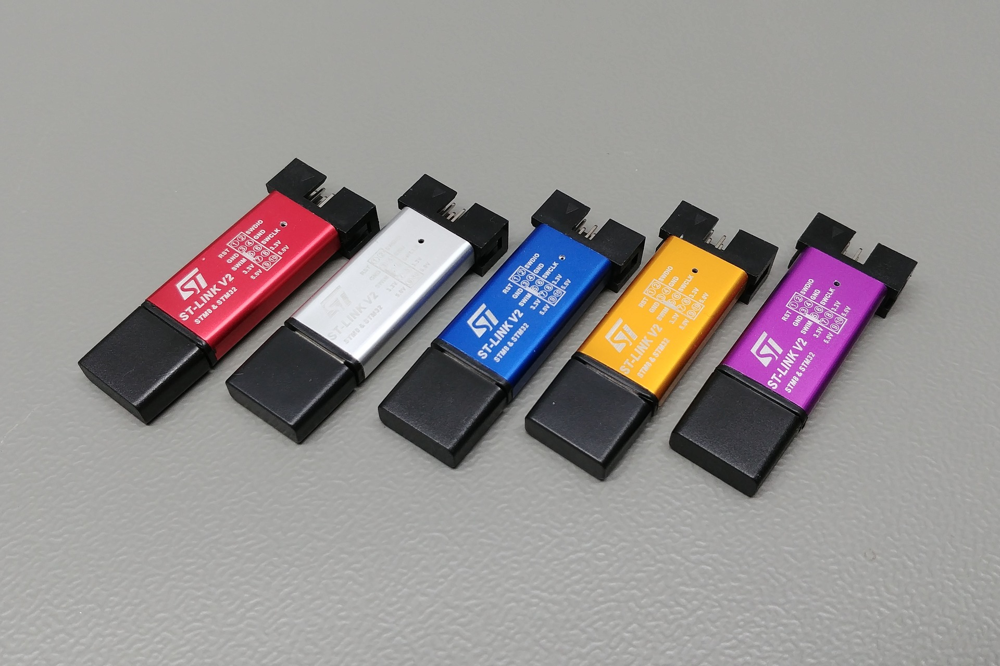
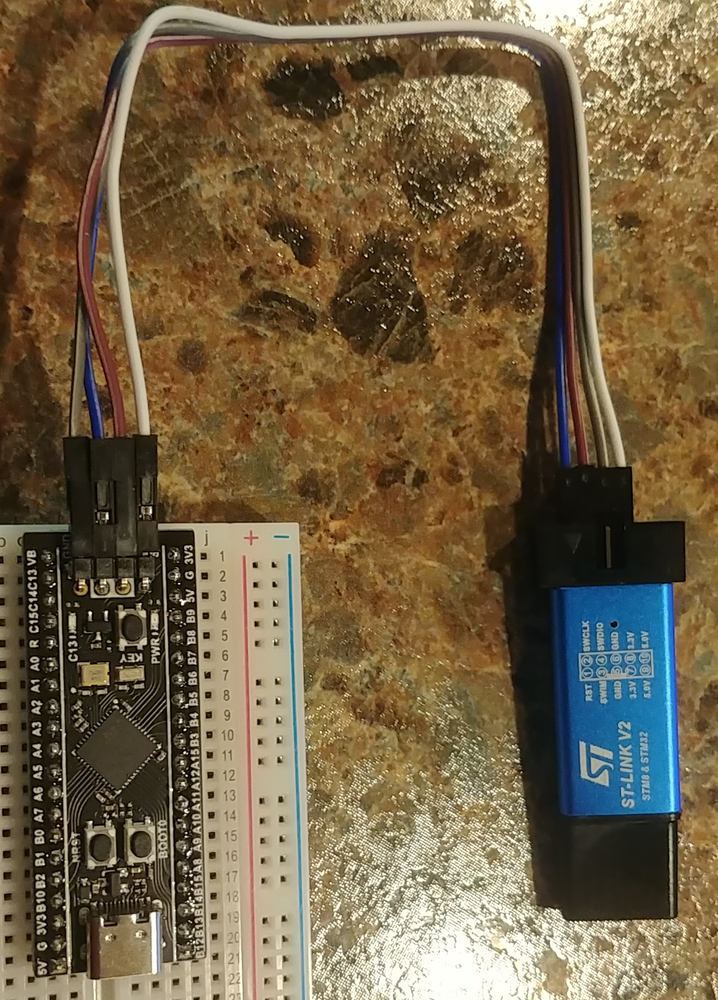

# Wiring & Connectivity

This chapter details the physical connections required to interface the STM32F411 (Black Pill) with your host machine and external hardware master devices.

## 1. Hardware Overview

The **STM32F411CEU6 Black Pill** is the core processing unit for Mimic. Below is a real-world view of the board's top side, showing the MCU, crystal, and breakout pins.

## 2. Programming Interface (ST-Link v2)

The primary method for deploying Mimic Firmware is via an ST-Link v2 programmer. The real-world hardware typically comes in a small USB-stick form factor as shown below.

### Connection Table
| ST-Link Pin | Black Pill Pin | Description |
| :--- | :--- | :--- |
| 3.3V | 3.3V | Target Power |
| GND | GND | Common Ground |
| SWDIO | DIO / PA13 | Data Line |
| SWCLK | CLK / PA14 | Clock Line |

## 3. Host Communication via TTL (UART2)

In cases where the USB-C port is not used for host communication, a **USB-to-TTL converter** (typically using the CP2102 chip) can be connected to **UART2** to provide full CLI control.

### Bridge Connection (TTL)
| Converter Pin | Black Pill Pin | Description |
| :--- | :--- | :--- |
| TX | PA3 (RX2) | Data from Host to MCU |
| RX | PA2 (TX2) | Data from MCU to Host |
| GND | GND | Common Ground |

## 4. Peripheral Hardware Mapping

To emulate sensors correctly, ensure your Master device (e.g., Raspberry Pi or Arduino) is connected to the following hardware ports on the Black Pill:

### UART (GPS Emulation)
- **TX (Master)** -> **RX (PA10)**
- **RX (Master)** -> **TX (PA9)**
- **GND** -> **GND**

### I2C (MPU6050 Emulation)
- **SCL**: PB6
- **SDA**: PB7

### SPI (BMP280 Emulation)
- **SCK**: PA5
- **MISO**: PA6
- **MOSI**: PA7
- **CS**: PA4

---
*© [Aegion Dynamic](https://aegiondynamic.com)*
